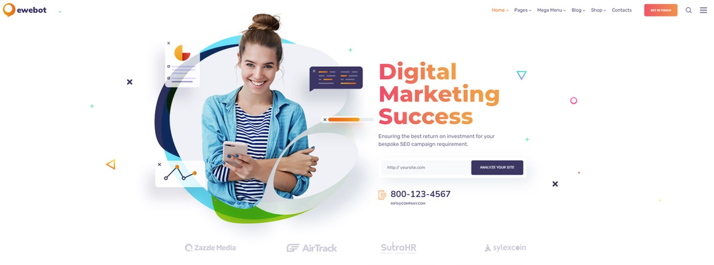
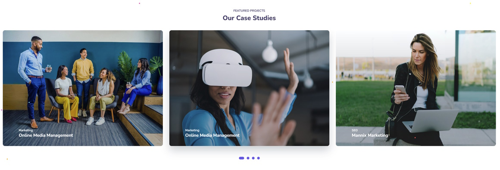

# Ewebot

_website design project_

<br>

## 🌟 About

This project is about teamwork to create a website. A group of students who work together to complete specific tasks and achieve a common goal. Practical elements of teamwork include planning workflows, regular meetings, maintaining open channels of communication, and other collaborative activities.

This project is for educational porpuses only. Pull request are welcome, but priority for project authors! Thank you for your cooperation!

Site published at: https://front-end-by-rimantas.github.io/43-grupe-portfolio-ewebot/

Design: [Ewebot](https://ewebotwp.com/home-10/?fbclid=IwAR38UbrKhivX_0eXkG06LaysYAbWk2MmGvuRnR7UY3jmK0GSQq-9PF7grYk)





## 🎯 Project features/goals

-   Github pages
-   responsive design
-   form
-   animations
-   icons
-   content rendering
-   gallery
-   slider
-   communication
-   problem-solving
-   creativity
-   adaptability
-   work ethic
-   time management

## 🧰 Getting Started

### 💻 Prerequisites

Node.js - _download and install_

```
https://nodejs.org
```

Git - _download and install_

```
https://git-scm.com
```

### 🏃 Run locally

Would like to run this project locally? Open terminal and follow these steps:

1. Clone the repo
    ```sh
    git clone https://github.com/front-end-by-rimantas/43-grupe-portfolio-ewebot
    ```
2. Install NPM packages
    ```sh
    npm i
    ```
    or
    ```sh
    npm install
    ```
3. Run the server
    ```sh
    npm run dev
    ```

### 🧪 Running tests

There is no tests for this project.

## 🌞 Authors

Rimantas: [Github](https://github.com/belauzas)\
Nerijus: [Github](https://github.com/NerijusBun)\
Aušra: [Github](https://github.com/AusraMundus)\
Povilas: [Github](https://github.com/baubasdrsk)\
Saulius: [Github](https://github.com/sauliuskarlinskas)\
Karolis: [Github](https://github.com/karolis879)

## ⚠️ License

Distributed under the MIT License. See LICENSE.txt for more information.
