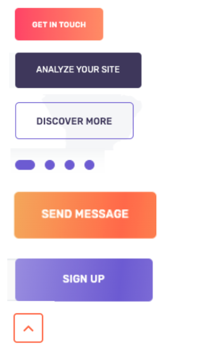

#CECCD6 partners logos
</>

#F6722D hover and other orange elements
</>

#3C3760 main tesxt and dark blue(violetish) elements
</>

#6657E0 </>

Linear grad.
from #FF5166 to #FE9055  buttons text ant etc.

 </>

 Linear grad. #F2A64C to  #FF7042

 </>

Linear grad.
from #9085EA to #7365E3

 </>

 </>

Some basic page elements</>

